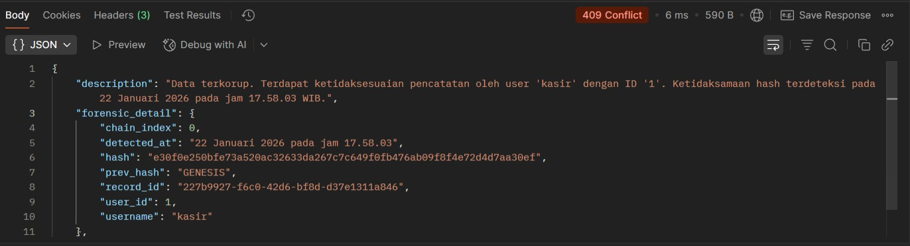

# 🔥 Seal of Ash – Ashbound Ledger

Seal of Ash adalah sistem backend forensik-keuangan berbasis **immutable ledger** dan **forensic integrity vault**.  
Project ini menggabungkan konsep sistem keuangan nyata dengan pendekatan digital forensik, di mana setiap perubahan data dapat dilacak, diverifikasi, dan dibuktikan secara kriptografis.

> *“Not just storing data, but witnessing truth.”*

---

## 👤 Author

**Yohanes Capelliou Samudra**  
Student of Software Engineering (RPL)  
Class: **XII RPL**  
Year: **2026**

Project ini dibuat ketika saya masih duduk di kelas XII RPL sebagai bentuk eksplorasi serius terhadap:
- Backend engineering
- Sistem keuangan immutable
- Digital forensics
- Security-oriented architecture

Saya ingin membuktikan bahwa backend bukan hanya soal CRUD,  
tetapi juga soal **kebenaran data, integritas sistem, dan kepercayaan**.

---

## 🧠 Core Concepts

Seal of Ash dibangun di atas 4 pilar utama:

1. **Immutable Ledger**
   - Transaksi tidak pernah di-update atau di-delete.
   - Kesalahan diperbaiki dengan:
     - Reversal transaction
     - Adjustment transaction

2. **Root Transaction (Case-Based)**
   - 1 transaksi utama = 1 kasus
   - Semua koreksi terikat dalam satu `root_id`
   - 1 ID → 1 cerita keuangan lengkap

3. **Forensic Vault (Hash Chain)**
   - Setiap peristiwa disimpan sebagai forensic record
   - Terikat dalam hash chain
   - Sekali diubah → sistem langsung mendeteksi korupsi data

4. **Call The Ashes**
   - Sistem bisa “memanggil kembali” sejarah transaksi
   - Menampilkan siapa, kapan, dan bagaimana sebuah data tercipta

---

## 🧾 Example: Forensic Breach Detection

Gambar berikut adalah salah satu fitur kebanggaan saya dalam project ini.  
Ketika data forensik dimanipulasi secara langsung di database, sistem langsung mendeteksi pelanggaran integritas dan memberikan laporan lengkap:

- Siapa pelakunya  
- ID user  
- Waktu kejadian (format Indonesia)  
- Posisi chain yang rusak  
- Hash yang tidak cocok  

---

## ⚙️ Tech Stack

- Language: **Go**
- Framework: **Gin Gonic**
- ORM: **GORM**
- Database:
  - MySQL (Ledger)
  - MySQL (Forensic Vault, terpisah)
- Auth: **JWT**
- Security:
  - Role-based access
  - Hash-chain forensic vault
  - Tamper detection

---

## 🔐 Roles

| Role       | Description |
|-----------|------------|
| user      | Kasir / staff input transaksi |
| supervisor| Approver koreksi keuangan |
| forensic  | Forensic investigator (Call The Ashes & Verify) |
| admin     | Administrasi sistem |

---

## 🏛️ Status

**Seal of Ash v1 – Completed**

Fitur yang sudah selesai:
- ✅ JWT Authentication  
- ✅ Role-based Access Control  
- ✅ Immutable Transaction System  
- ✅ Reversal & Adjustment  
- ✅ Root Transaction (1 ID = 1 Case)  
- ✅ Forensic Vault with Hash Chain  
- ✅ Tamper Detection  
- ✅ Forensic Case Reconstruction  
- ✅ Human-readable Indonesian Timestamp  

---

## 🩸 Philosophy

Seal of Ash bukan hanya project backend.

Ini adalah:
> Sebuah sistem yang tidak hanya menyimpan data,  
> tetapi mampu bersaksi ketika kebenaran disentuh.

---

## 📌 Note

Project ini dibuat sebagai:
- Eksplorasi personal backend engineering
- Latihan sistem enterprise-level
- Portofolio serius untuk masa depan

Jika kamu membaca ini, berarti Seal of Ash sudah menjalankan tugasnya:  
**menjadi saksi atas kebenaran data.**

